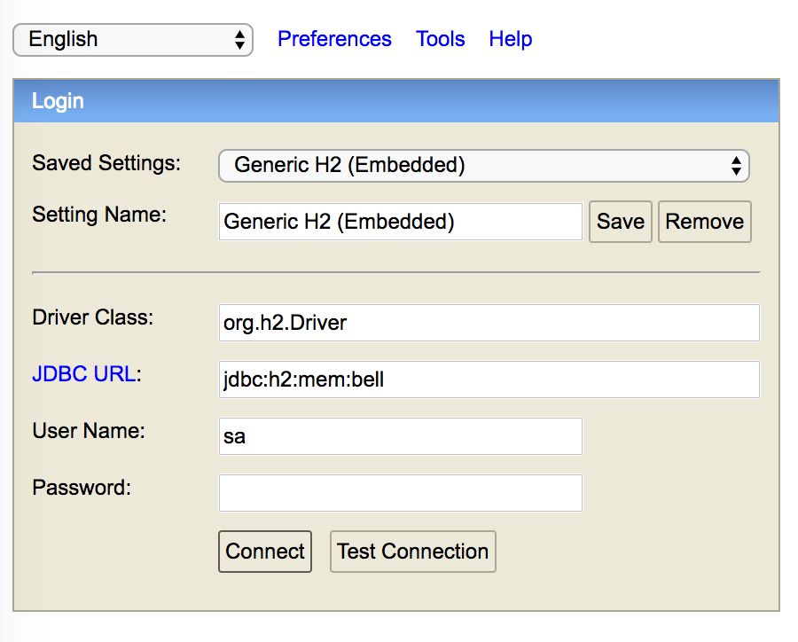

# Bell : Spring Boot Vanilla Projet

### Environnement (Pré-requis)
<p>
L'application a été développée dans l'environnement suivant.
</p>
<ul>
<li>Java 8</li>
<li>Tomcat 8.5</li>
</ul>
Pour éviter toute surprise il est préférable de reproduire cet environnement avant l'installation ;-).

### Installation

Le processus d'installation est relativement simple vu l'utlisation de Spring Boot et d'une base de données "In Memory". Elle se limite donc aux deux étapes ci-dessous.
Ainsi une fois le projet téléchargé (ou cloner) via GitHub, ouvrir un terminal, se déplacer à la racine du répertoire téléchargé (ex. : <i>"cd ~/Bell-master/"</i>) puis lancer les deux commandes :

1. Génération d'un JAR exécutable 

<b>mvn clean package</b>

2. Démarrage de l'application

<b>java -jar target/bell-0.0.1-SNAPSHOT.jar</b>


### Database (In Memory)
 
 La base de donneées SQL a été configurée en utilisant l'outil de persistence 
 <b>H2 database</b>. Le fonctionnement de <i>H2</i> est rendu possible (chargement des drivers, propriétés de connexion), par l'ajout des jars nécessaires (dépendences) dans le classpath de l'application via <i>Maven</i> : 
 
```xml
<dependency>
    <groupId>com.h2database</groupId>
    <artifactId>h2</artifactId>
</dependency>
```
 Ensuite le fichier <b>application.properties</b> a été configuré comme suit : 
 
 <b>Spring Boot Configuration</b>
 
 ```properties
 spring.datasource.url=jdbc:h2:mem:bell;MVCC=true;DB_CLOSE_DELAY=-1;MODE=MySQL
 spring.datasource.username=sa 
 spring.datasource.password=
 spring.datasource.driver-class-name=org.h2.Driver 
 spring.datasource.platform=h2
 spring.datasource.initialize=true
 spring.h2.console.enabled=true
 spring.jpa.hibernate.ddl-auto=none
 spring.session.store-type=none
 security.user.password=root
 ```
 
Aussi H2 permet de créer la base de données SQL au démarrage de l'application en ajoutant respectivement les scripts SQL 
pour la création de la structure et des données (insertions), à la racine du répertoire <b>src/main/resources/</b> :

<b>schema-h2.sql</b>    &nbsp;&nbsp;&nbsp;&nbsp;&nbsp;&nbsp;&nbsp;&nbsp;&nbsp;&nbsp;&nbsp;&nbsp;&nbsp;&nbsp;&nbsp;    <b>data-h2.sql</b>

Ainsi une fois l'application démarrée, la base de données est accessible via la console H2 à partir de l'url locale : 

<a href="http://localhost:8080/h2-console">http://localhost:8080/h2-console</a>

Par la suite pour se connecter à la base de données <b>bell</b> créer en mémoire, il faut cliquer sur le bouton "Connect",
en s'assurant avant que les paramètres de connexion requis sont corrects (Voir capture d'écran ci-dessous).



### Rest API

<i>Headers :</i>   

Accept: application/json
Content-Type: application/json

#### Welcome
GET 
http://localhost:8080/


#### Afficher un catalogue de produits
Catalog ID : 1,2

GET 
http://localhost:8080/product/catalog/{catalogId}


#### Afficher le détail d’un produit
Product ID : 1,2, ... 12, 17

GET 
http://localhost:8080/product/{productId}


#### Ajouter un produit au panier

POST
http://localhost:8080/product

{
    userId:{productId},
    productId:{productId},
    quantity:{quantity}
}
<br/>

#### Enlever un produit du panier

DELETE
http://localhost:8080/cart/{userId}/{productId}


#### Afficher le contenu du panier
Affiche le contenu du panier pour un utilisateur donné par son id.
User ID : 1,2


GET
http://localhost:8080/cart/{userId}


